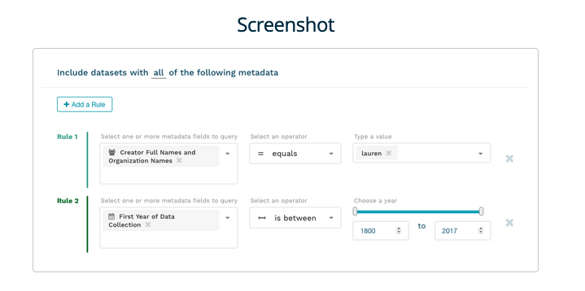

# A very simple plugin for JSDoc to display screenshot images

This is a simple JSDoc plugin that inserts an image into the HTML pages created by the JSDoc build process. I created this plugin because I wanted the built documentation webpages to show what a particular component of a JS application looks like for the end user.

This plugin uses a new tag, named @screenshot, whose value is an absolute or relative URL to an image file. Although the image contents don't need to be of a screenshot, the tag name (@screenshot) was chosen to provide context to the image contents when looking at the JSDoc comments inline with code.

## To use

`javascript
@screenshot MyView.png
@screenshot https://my-site.com/MyView.png
``



You can view some live examples on the [MetacatUI documentation website](https://nceas.github.io/metacatui/docs/QueryBuilderView.html) which is the project I originally wrote this code for.

## Install
1. Step 1. Add the `jsdoc-screenshot/src` directory with the `screenshot.js` file to whatever location you normally store your JSDoc plugins for your application and rename it to whatever you want (e.g. `screenshot`).

2. Step 2. Add this as a plugin to your JSDoc configuration. Specify a directory where your screenshot images will be stored (if you are storing all your images externally, this isn't necessary).

JSDoc config file snippet example:

``json
  "plugins": ["jsdoc-plugins/screenshot"],
 "screenshot": {
   "dir": "../screenshots"
 }
``

3. Step 3. Add the following code to any JSDoc template(s) where you want to show the screenshot image. You can customize this HTML however you'd like.

Example:

```
<?js if (doc.screenshot) { ?>
   <div class="screenshot">
     <h3>Screenshot</h3>
     " />
   </div>
<?js } ?>
```

4. Step 4. Use the new @screenshot tag in your JSDoc comments.

Example @screenshot tags:

`javascript
@screenshot MyView.png
@screenshot https://my-site.com/MyView.png
``
